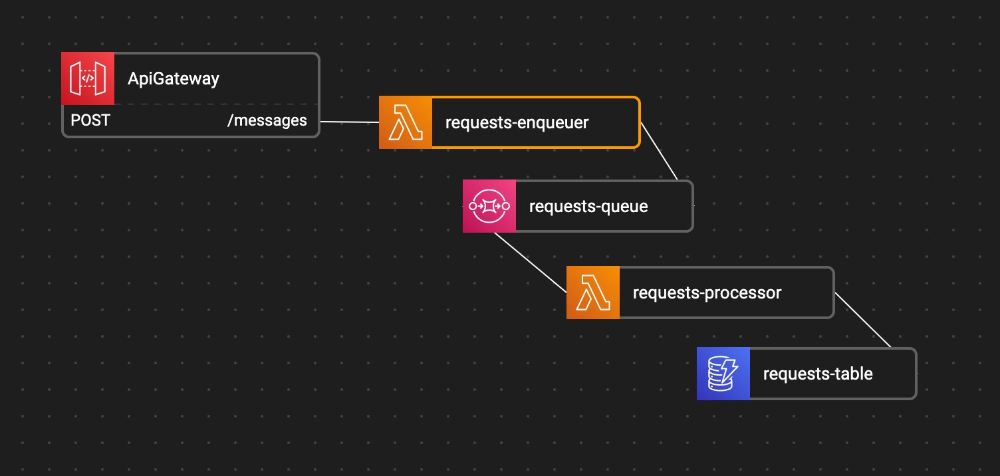
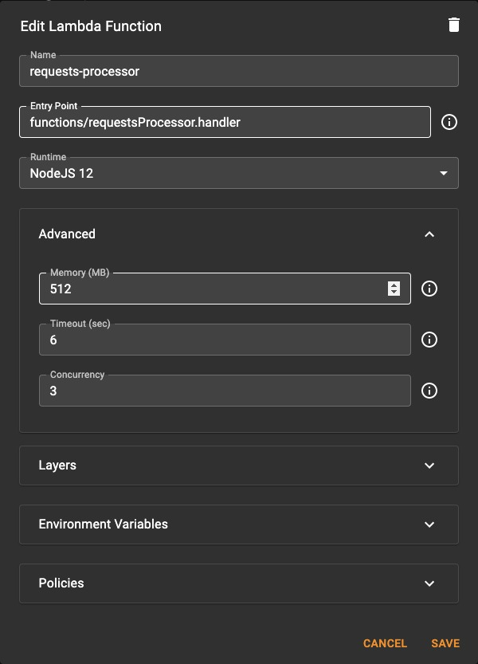

# The Scalable Webhook

Though very usefull in the cases of webhooks, the "Scalable Webhook" pattern is useful whenever you need to decouple live requests from long background work (think of updating a db, querying external services, and so forth).

Many of our customers at Altostra have been using some form or another of this populear pattern, and in this post we'll see how you can easily implements it using altostra (or just use the Altostra template).

## What are we trying to solve?

Let's say you're a developer working in a marketing company with a loyal clientele of a few hundred thousand customers. You're keeping your happily engaged customers up-to-date with customized emails, and whenever an email is opened, clicked, or marked as spam, you get a call to your api address (the webhook) with the id of the email and the type of the event ("Clicked", "Opened", "Spam").

You need to:
1. Verify that the call is authentic and not fake (quite fast), and
2. Mark the specific products in the email as "viewed" by the customer using an internal RDS DB
3. Keep the email statistics for farther processing by the marketing team

The basic solution is simple: Connect an API Gateway route to a Lambda function, validate the message, marks the email as read in your RDS DB, and save it to a high volume dynamoDb. This should work, no?

As You probably already figured out, this sunny day scenario is not going to last long - it will probably fail in the first high-traffic peak.

First, there's the too-easy-to-forget AWS Concurrent executions limit - this means that you can have at most ~1,000 lambdas running in the same time at the same region (for **all** your Lambda functions, not 1000 per function). This means that if you'll have a sudden peak in requests (e.g, everybody opened their emails first thing monday morning) - you're busted, and you're loosing data.

Second point is your DB. If you're working with a good old RDS DB, you know that writing to it takes a while - which means that your lambda takes longer to run, which means that even if the incomning requests rate is not that high, you're still likely to reach the concurrent execution limit - and in the process, load the DB so much that other, unrelated services might be also effected.

Third point is your other services - if your lambda need to do anything that require any external service, you'll need to make sure that this other service is capable of coping with your incoming request rates - and sometimes that's just aint possible, in cases where you're using services which limit query/minute rates.

So, what we need is a way to save all the data that arrives, and process it in our desired rate. That's right, we need a Queue. But not only do we need a queue, we also need to limit the concurrency level of our executing lambda so we won't kill our DB or other services (we'll just be pushing our problem downstream)

## Solution Outline

What we're going to use:

1. Api Gateway to receive our calls
2. A enqueuing Lambda function to validate and write the request into the Queue
3. An SQS queue to hold all the messages until we can handle them
4. A processing Lambda function to do the actual work in the rate we need
5. A high frequency DB to keep all the data we collected from the events - We'll use a simple DynamoDB table for this case.

This is how the Altostra Blueprint would look like:

The sample code for the `enqueue` function

The sample code for the `processor` function

## Setting the Reserved Concurrency

Once we have all these resources in place, the only thing we're missing is to limit the amount of concurrently running instances of the `Processor` Lambda function:

Go to the `Processor` function -> Advanced -> Concurrency, and set it to 3.

Setting the `Concurrency` does 2 things:
1. Reserves a quota of 3 instances for this Lambda function, so it will never get starved by other lambdas (like the enqueue lambda, for example)
2. Makes sure that no more than 3 instances of this lambda are running at the same time.

So to sum it all up, our solution makes sure that when we recieve a high volume of concurrent requests:
1. We don't lose any because we will write them all to the SQS Queue
2. All of the request will be processed
3. We won't be hogginbg our DB or any other external services because at most, only 3 instance of the function will be running at the same time.

Other considerations to remember:
1. **Some messages might be processed more than once** - SQS regular queue (unlike the FIFO SQS) promises that all the messages would be processed **at least** once - So you would need to make sure that your functions are ideopmetent.
2. **SQS queues has a limit of 120,000 in-flight messages** (Received and not yet removed). If you think your buffer needs to be larger, you should consider splitting the messages between queues, or switching to Kinesis (We'll touch that in a future post)

